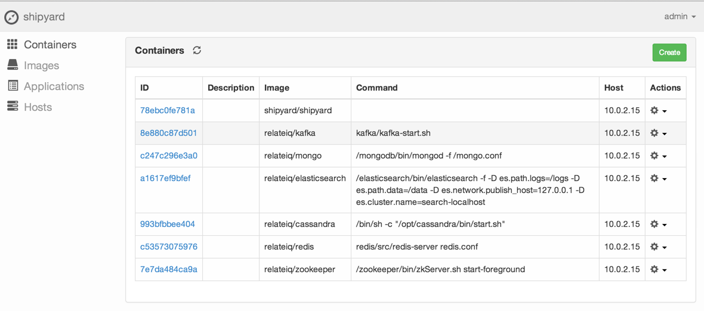

# Instant RelateIQ Development Environment

Read through [A Docker Dev Environment in 24 Hours! (Part 2 of 2)](http://blog.relateiq.com/a-docker-dev-environment-in-24-hours-part-2-of-2/) then come back here.

## Installation:

### Linux

Install Virtualbox based off the [installation instructions](https://www.virtualbox.org/wiki/Linux_Downloads).

### MacOS

#### Install Homebrew

First, install [Homebrew](http://brew.sh/).

```
ruby -e "$(curl -fsSL https://raw.github.com/mxcl/homebrew/go)"
```

#### Install Virtualbox and Vagrant

Install VirtualBox and Vagrant using [Brew Cask](https://github.com/phinze/homebrew-cask).

```
brew tap phinze/homebrew-cask
brew install brew-cask
brew cask install virtualbox
brew cask install vagrant
```

## Check out the repository

```
git clone https://github.com/relateiq/docker_public
cd docker_public
vagrant up
```

After Guest Additions is in, reload the vagrant:

```
vagrant reload
vagrant ssh
```

## Update devenv

This will pull all the images from the server and update Docker's configuration for Shipyard.

```
./bin/devenv update
vagrant reload
```

### Configure Shipyard

Once the server has rebooted, you should have shipyard up.  The credentials are "shipyard/admin".

* Go to http://localhost:8005/hosts/ to see Shipyard's hosts.
* In the vagrant VM, `ifconfig eth0` and look for "inet addr:10.0.2.15" -- enter the IP address.

## Run devenv start

Start the devenv container:

```
./bin/devenv start
```

You should see:

```
➜  docker_public git:(master) ✗ ./bin/devenv start
Started ZOOKEEPER in container b7af4a32fd11
Started REDIS in container f49c9910da35
Started CASSANDRA in container 52f3233972fb
Started ELASTICSEARCH in container 802a9f1139d9
Started MONGO in container 33e5df9178a4
Started KAFKA in container d3475cfe8161
```

Now look at [http://localhost:8005/containers/](http://localhost:8005/containers/) and you should see your containers.



## Conclusion

You're all done!

